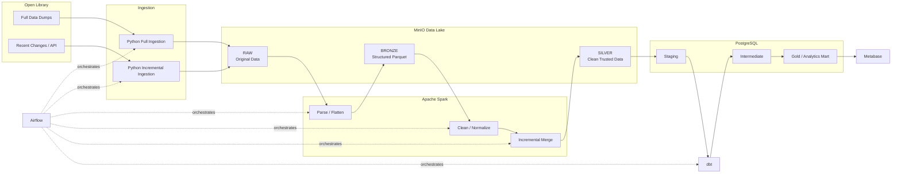

# Open Library End-to-End Data Engineering Project

## 1. Tổng quan dự án

### Tên dự án

**Open Library Analytics Data Platform**

### Mục tiêu

Xây dựng một hệ thống Data Engineering end-to-end sử dụng dữ liệu Open Library nhằm:

- Thu thập và quản lý dữ liệu từ Open Library Data Dumps.
- Xử lý dữ liệu lớn bằng Apache Spark.
- Xây dựng Data Lake theo kiến trúc Raw → Bronze → Silver.
- Hỗ trợ cả Initial Full Load và Incremental Processing.
- Xây dựng Data Warehouse bằng PostgreSQL.
- Sử dụng dbt để xây dựng các analytical models.
- Điều phối pipeline bằng Apache Airflow.
- Trực quan hóa dữ liệu bằng Metabase.
- Đảm bảo pipeline có tính idempotent, kiểm tra chất lượng dữ liệu và khả năng chạy lại.

Project được thiết kế ở mức **Intern/Fresher Data Engineer** nên ưu tiên hiểu sâu các công nghệ cốt lõi thay vì thêm quá nhiều công nghệ.

---

# 2. Tech Stack

| Thành phần | Công nghệ | Vai trò |
|---|---|---|
| Source | Open Library Dumps / API | Nguồn dữ liệu |
| Ingestion | Python | Đưa dữ liệu vào Data Lake |
| Data Lake | MinIO | Object Storage, mô phỏng Amazon S3 |
| Processing | Apache Spark / PySpark | Xử lý dữ liệu lớn |
| Data Format | Parquet | Lưu Bronze/Silver |
| Warehouse | PostgreSQL | Analytics database |
| Transformation | dbt | Business transformation |
| Orchestration | Apache Airflow | Điều phối pipeline |
| Visualization | Metabase | Dashboard |
| Environment | Docker Compose | Chạy toàn bộ hệ thống |
| Version Control | Git/GitHub | Quản lý source code |

Không sử dụng trong phiên bản đầu:

```text
Kafka
Kubernetes
Iceberg
Delta Lake
Trino
Flink
Terraform
DataHub
OpenMetadata
```

Các công nghệ trên chỉ được xem xét sau khi phiên bản hiện tại hoàn chỉnh.

---

# 3. Kiến trúc tổng thể



---

# 4. Data Flow

Data lifecycle:

```text
Open Library
      ↓
Python Ingestion
      ↓
MinIO RAW
      ↓
Spark
      ↓
Bronze Parquet
      ↓
Spark
      ↓
Silver Parquet
      ↓
Data Quality
      ↓
PostgreSQL Staging
      ↓
dbt
      ↓
Gold Analytics
      ↓
Metabase
```

Airflow đứng bên ngoài để điều phối toàn bộ quy trình.

---

# 5. Hai loại pipeline

Project sử dụng hai pipeline khác nhau.

## Pipeline A — Initial Full Load

Dùng để bootstrap hệ thống lần đầu.

```text
Open Library Full Dump
        ↓
MinIO RAW
        ↓
Spark Parse
        ↓
Bronze
        ↓
Spark Clean
        ↓
Silver
        ↓
PostgreSQL
        ↓
dbt
        ↓
Gold
```

Full Load có thể chạy khi:

- Khởi tạo hệ thống lần đầu.
- Cần rebuild toàn bộ dữ liệu.
- Có snapshot mới cần backfill.

---

## Pipeline B — Incremental Processing

Sau Initial Load, hệ thống chỉ xử lý những record mới hoặc thay đổi.

```text
Open Library Recent Changes
        ↓
Read Watermark
        ↓
Fetch New Changes
        ↓
RAW Incremental
        ↓
Spark
        ↓
Deduplicate
        ↓
Merge Silver
        ↓
Update PostgreSQL
        ↓
dbt
        ↓
Update Watermark
```

Ví dụ Silver đang có:

```text
work_key    revision
OL1W        3
OL2W        7
OL3W        2
```

Incremental batch:

```text
OL2W        8
OL4W        1
```

Sau processing:

```text
OL1W        3
OL2W        8
OL3W        2
OL4W        1
```

Trong đó:

```text
OL2W → UPDATE
OL4W → INSERT
```

---

# 6. Data Lake Design

Bucket:

```text
openlibrary-data-lake
```

Structure:

```text
openlibrary-data-lake/

├── raw/
│   └── openlibrary/
│       ├── works/
│       ├── ratings/
│       ├── authors/
│       ├── reading_logs/
│       └── incremental/
│
├── bronze/
│   └── openlibrary/
│       ├── works/
│       ├── ratings/
│       ├── authors/
│       └── reading_logs/
│
└── silver/
    └── openlibrary/
        ├── works/
        ├── ratings/
        ├── authors/
        └── reading_logs/
```

---

# 7. Vai trò của từng Data Layer

## RAW

RAW lưu dữ liệu source nguyên bản.

Ví dụ:

```text
ol_dump_works_latest.txt.gz
```

Nguyên tắc:

```text
Không clean
Không transform
Không overwrite tùy tiện
Không thay đổi source
```

RAW tồn tại để:

- Audit.
- Debug.
- Replay pipeline.
- Rebuild downstream.

---

## BRONZE

Bronze biến dữ liệu khó đọc thành structured data.

Ví dụ Open Library:

```text
/type/work
/works/OL123W
3
2026-...
{"title":"..."}
```

Bronze:

```text
record_type
work_key
revision
last_modified
json_payload
source_file
ingested_at
```

Bronze chủ yếu thực hiện:

```text
Parse TSV
Parse JSON
Schema casting
Corrupt record handling
Basic field extraction
```

Format:

```text
Parquet
```

---

## SILVER

Silver là dữ liệu:

```text
clean
normalized
deduplicated
validated
reusable
```

Ví dụ:

```text
silver_works
```

schema:

```text
work_key
title
author_keys
subjects
created_at
last_modified
revision
```

`silver_ratings`:

```text
work_key
edition_key
rating
rating_date
```

Silver không chứa logic kiểu:

```text
Top 10 books
Popularity score
Author ranking
```

Đó là business logic thuộc Gold/dbt.

---

# 8. Vai trò Apache Spark

Spark là processing engine chính.

Spark xử lý:

```text
Parsing
Flatten nested JSON
Schema enforcement
Type casting
Deduplication
Normalization
Large joins
Incremental processing
Revision comparison
Parquet writing
```

Ví dụ:

```text
RAW
 ↓
Spark
 ↓
Bronze

Bronze
 ↓
Spark
 ↓
Silver
```

Không sử dụng Spark chỉ để:

```text
SELECT COUNT(*)
```

hoặc những business query nhỏ.

---

# 9. PostgreSQL

PostgreSQL đóng vai trò Analytics Warehouse.

Không đưa RAW và Bronze vào PostgreSQL.

Pipeline:

```text
Silver
 ↓
PostgreSQL staging
```

Ví dụ:

```text
staging.stg_works
staging.stg_ratings
staging.stg_authors
```

PostgreSQL sau đó được dbt sử dụng để xây:

```text
intermediate
gold
```

---

# 10. Vai trò dbt

dbt xử lý business transformation.

Spark:

```text
Technical Data Transformation
```

dbt:

```text
Analytical / Business Transformation
```

Ví dụ:

```text
stg_works ─────┐
               ▼
         int_work_rating
               ▲
stg_ratings ───┘
               ↓
        agg_work_rating
```

dbt còn phụ trách:

- SQL models.
- Model dependencies.
- Data tests.
- Documentation.
- Lineage.
- Incremental model ở phase nâng cao.

---

# 11. Vai trò Airflow

Airflow không xử lý data trực tiếp.

Airflow làm:

```text
Scheduling
Dependency management
Retry
Monitoring
Task status
Workflow orchestration
```

Ví dụ Incremental DAG:

```text
read_watermark
       ↓
check_new_data
       ↓
ingest_incremental
       ↓
spark_bronze
       ↓
spark_silver
       ↓
quality_check
       ↓
load_postgres
       ↓
dbt_run
       ↓
dbt_test
       ↓
update_watermark
```

Nếu:

```text
check_new_data = false
```

thì downstream tasks được skip.

---

# 12. Watermark

Tạo bảng:

```text
pipeline_watermark
```

Schema:

```text
pipeline_name
last_processed_at
last_revision
updated_at
```

Ví dụ:

```text
openlibrary_works_incremental
2026-09-15 02:00:00
```

Nguyên tắc:

> Chỉ update watermark khi pipeline hoàn toàn thành công.

Pipeline:

```text
Read watermark
      ↓
Fetch data
      ↓
Process
      ↓
Quality Check
      ↓
Load
      ↓
dbt Test
      ↓
SUCCESS
      ↓
Update Watermark
```

---

# 13. Idempotency Requirement

Pipeline chạy lại không được tạo duplicate.

Ví dụ:

```text
Run 1:

OL1
OL2
OL3
```

Run lại:

```text
OL1
OL2
OL3
```

không được thành:

```text
OL1
OL2
OL3
OL1
OL2
OL3
```

Incremental phải có cơ chế:

```text
business key
+
revision
+
deduplicate
```

---

# 14. Data Quality Requirements

## Works

Kiểm tra:

```text
work_key NOT NULL

work_key UNIQUE

revision >= 1

last_modified valid timestamp
```

## Ratings

```text
work_key NOT NULL

rating BETWEEN 1 AND 5
```

## Referential Integrity

```text
ratings.work_key
        ↓
works.work_key
```

Cần tính:

```text
total_rating_rows

matched_rating_rows

unmatched_rating_rows

match_rate
```

Không được silent drop record lỗi.

---

# 15. Logging

Mỗi pipeline run nên có:

```text
run_id

pipeline_name

dataset

start_time

end_time

rows_read

rows_written

rows_rejected

status

error_message
```

Ví dụ:

```text
pipeline_name = works_raw_to_silver

rows_read      = 30,000,000
rows_written   = 29,850,000
rows_rejected  = 150,000

status         = SUCCESS
```

---

# 16. Business Use Cases

Project không cố giải quyết mọi bài toán ngay lập tức.

Các use case được xây theo từng phase.

---

# Use Case 1 — Trustworthy Top-Rated Works

## Business Question

> Những tác phẩm nào được đánh giá cao nhất và có đủ số lượng rating để kết quả đáng tin cậy?

## Data

```text
Works
+
Ratings
```

## Metrics

```text
rating_count
average_rating
weighted_rating
rank
```

Gold table:

```text
agg_work_rating
```

Schema:

```text
work_key
title
rating_count
avg_rating
weighted_rating
ranking
```

Dashboard:

```text
Top Rated Works
Most Rated Works
Rating Distribution
Average Rating vs Rating Count
```

Đây là **MVP use case đầu tiên**.

---

# Use Case 2 — Author Performance

## Question

> Tác giả nào có nhiều tác phẩm được đánh giá cao?

Data:

```text
Works
Ratings
Authors
```

Model:

```text
dim_author

bridge_work_author

dim_work

fact_rating
```

Metrics:

```text
total_works

total_ratings

average_rating

high_rated_work_count
```

Gold:

```text
agg_author_performance
```

---

# Use Case 3 — Subject Analytics

## Question

> Chủ đề/thể loại nào có nhiều tác phẩm được đánh giá tốt?

Data:

```text
Works.subjects
+
Ratings
```

Model:

```text
dim_subject

bridge_work_subject
```

Metrics:

```text
work_count

rating_count

avg_rating

weighted_rating
```

Gold:

```text
agg_subject_performance
```

---

# Use Case 4 — Reading Popularity

## Question

> Những tác phẩm nào được người dùng quan tâm nhiều nhất?

Data:

```text
Works
Ratings
Reading Logs
```

Metrics:

```text
want_to_read_count

currently_reading_count

already_read_count

rating_count

popularity_score
```

Gold:

```text
agg_work_popularity
```

---

# Use Case 5 — Incremental Updates

Đây là technical use case.

## Question

> Hệ thống xử lý như thế nào khi Open Library có book mới hoặc book cũ thay đổi?

Ví dụ:

```text
Existing:

OL100W revision 5
```

Increment:

```text
OL100W revision 6
OL200W revision 1
```

Kết quả:

```text
OL100W → UPDATE
OL200W → INSERT
```

Use case này chứng minh:

```text
incremental ingestion

watermark

deduplication

upsert

idempotency
```

---

# 17. Project Phases

## PHASE 0 — Project Setup

### Mục tiêu

Xây môi trường development.

### Tasks

```text
Create Git repository

Create folder structure

Create Docker Compose

Run MinIO

Run PostgreSQL

Configure Spark

Prepare .env.example

Prepare README
```

### Deliverable

```text
docker compose up
```

phải chạy được:

```text
MinIO
PostgreSQL
```

Spark có thể chạy local hoặc container.

---

# PHASE 1 — Data Exploration

### Dataset

```text
Open Library Works
Open Library Ratings
```

### Tasks

Phân tích:

```text
file format

schema

row count

null

duplicates

nested JSON

business keys

revision

last_modified
```

Xác định:

```text
work_key
```

là key chính cho Works.

### Deliverable

```text
docs/data_profile.md
```

---

# PHASE 2 — RAW Ingestion

### Mục tiêu

Đưa source vào MinIO.

Pipeline:

```text
Local/Open Library
      ↓
Python
      ↓
MinIO RAW
```

Structure:

```text
raw/openlibrary/works/

raw/openlibrary/ratings/
```

### Requirements

Không clean data.

Lưu metadata:

```text
source_file
ingested_at
run_id
```

### Deliverable

Python ingestion scripts.

---

# PHASE 3 — Bronze Pipeline with Spark

### Mục tiêu

Parse source thành structured Parquet.

Works:

```text
TSV
+
JSON
 ↓
Spark
 ↓
Bronze Parquet
```

Ratings:

```text
CSV
 ↓
Spark
 ↓
Bronze Parquet
```

### Tasks

```text
parse
cast schema
extract fields
handle corrupt rows
add ingestion metadata
```

### Deliverable

```text
bronze/openlibrary/works/

bronze/openlibrary/ratings/
```

---

# PHASE 4 — Silver Pipeline with Spark

### Mục tiêu

Tạo clean trusted datasets.

Tasks:

```text
normalize work_key

remove invalid records

deduplicate

type casting

timestamp normalization

rating validation
```

Output:

```text
silver_works

silver_ratings
```

### Data quality

```text
work_key unique

rating 1–5

null checks

relationship checks
```

Đây là phase quan trọng nhất về Spark.

---

# PHASE 5 — PostgreSQL Warehouse

Load Silver data:

```text
silver_works
 ↓
stg_works

silver_ratings
 ↓
stg_ratings
```

Requirements:

```text
Primary key

Index

Correct data types

UPSERT support
```

Deliverable:

```text
staging schema
```

---

# PHASE 6 — dbt Analytics

Models:

```text
models/

├── staging/
│   ├── stg_works.sql
│   └── stg_ratings.sql
│
├── intermediate/
│   └── int_work_rating.sql
│
└── marts/
    └── agg_work_rating.sql
```

Tests:

```text
not_null

unique

relationships
```

Deliverable:

```text
agg_work_rating
```

---

# PHASE 7 — Dashboard

Metabase kết nối PostgreSQL.

Dashboard:

```text
Open Library Analytics
```

Cards:

```text
Total Works

Total Ratings

Top Rated Works

Most Rated Works

Rating Distribution

Rating Count vs Average Rating
```

MVP lúc này được xem là hoàn thành.

---

# PHASE 8 — Incremental Pipeline

Sau khi full pipeline ổn định mới làm incremental.

Source:

```text
Recent Changes / simulated incremental batch
```

Tasks:

```text
read watermark

fetch new records

write raw incremental

Spark clean

compare revision

deduplicate

merge Silver

UPSERT PostgreSQL

dbt refresh

update watermark
```

Ban đầu có thể giả lập:

```text
incremental_001.json
incremental_002.json
```

rồi mới kết nối API thật.

---

# PHASE 9 — Airflow

Chỉ thêm Airflow sau khi tất cả scripts chạy độc lập.

## Initial DAG

```text
ingest_full_dump
      ↓
bronze_works
      ↓
bronze_ratings
      ↓
silver_works
      ↓
silver_ratings
      ↓
quality_check
      ↓
load_postgres
      ↓
dbt_run
      ↓
dbt_test
```

## Incremental DAG

```text
read_watermark
      ↓
check_changes
      ↓
ingest_changes
      ↓
spark_incremental
      ↓
quality_check
      ↓
update_postgres
      ↓
dbt_run
      ↓
dbt_test
      ↓
update_watermark
```

---

# PHASE 10 — Add Authors

Dataset:

```text
Authors Dump
```

Spark pipeline:

```text
RAW
 ↓
Bronze
 ↓
Silver
```

dbt:

```text
dim_author

bridge_work_author

agg_author_performance
```

Use Case 2 được hoàn thành.

---

# PHASE 11 — Subject Analytics

Subjects lấy từ Works.

Transform nested:

```text
work
subjects[]
```

thành:

```text
work_key
subject
```

Tạo:

```text
bridge_work_subject

agg_subject_performance
```

---

# PHASE 12 — Reading Logs

Thêm:

```text
Reading Logs
```

Pipeline:

```text
Raw
 ↓
Bronze
 ↓
Silver
 ↓
PostgreSQL
 ↓
dbt
```

Tạo:

```text
fact_reading_log

agg_work_popularity
```

---

# 18. Repository Structure

```text
openlibrary-data-platform/

├── ingestion/
│   ├── full/
│   │   ├── ingest_works.py
│   │   └── ingest_ratings.py
│   │
│   ├── incremental/
│   │   └── ingest_changes.py
│   │
│   └── common/
│
├── spark/
│   ├── bronze/
│   │   ├── works.py
│   │   └── ratings.py
│   │
│   ├── silver/
│   │   ├── works.py
│   │   └── ratings.py
│   │
│   └── incremental/
│       └── merge_works.py
│
├── warehouse/
│   ├── ddl/
│   └── loaders/
│
├── dbt/
│   └── openlibrary/
│       ├── models/
│       │   ├── staging/
│       │   ├── intermediate/
│       │   └── marts/
│       └── tests/
│
├── airflow/
│   └── dags/
│
├── data_quality/
│
├── tests/
│   ├── unit/
│   ├── integration/
│   └── fixtures/
│
├── docs/
│   ├── architecture.md
│   ├── data_model.md
│   └── data_dictionary.md
│
├── docker-compose.yml
├── requirements.txt
├── .env.example
├── .gitignore
└── README.md
```

---

# 19. Functional Requirements

Hệ thống phải:

1. Ingest được Open Library dumps.
2. Lưu source nguyên bản trong MinIO.
3. Parse source bằng Spark.
4. Lưu Bronze dạng Parquet.
5. Clean dữ liệu bằng Spark.
6. Lưu Silver dạng Parquet.
7. Detect duplicate.
8. Validate schema.
9. Validate rating.
10. Load Silver vào PostgreSQL.
11. dbt tạo analytical marts.
12. Có dbt tests.
13. Metabase đọc Gold tables.
14. Hỗ trợ initial full load.
15. Hỗ trợ incremental update.
16. Có watermark.
17. Pipeline chạy lại không tạo duplicate.
18. Airflow quản lý dependency và retry.

---

# 20. Non-Functional Requirements

## Maintainability

Code phải chia module.

Không viết một file:

```text
pipeline.py
```

dài hàng nghìn dòng.

---

## Reproducibility

Người khác clone repo phải có thể:

```bash
docker compose up
```

và setup project dựa trên README.

---

## Idempotency

Rerun pipeline phải cho cùng kết quả.

---

## Scalability

Pipeline phải xử lý được:

```text
100K rows
1M rows
10M+ rows
```

mà không cần rewrite architecture.

---

## Recoverability

Nếu Silver transform sai:

```text
RAW
 ↓
reprocess
 ↓
Silver
```

---

## Data Quality

Không silent drop malformed records.

Cần log:

```text
valid rows
invalid rows
duplicate rows
orphan rows
```

---

# 21. MVP Definition

Không cần làm hết 12 phase mới gọi là hoàn thành.

**MVP hoàn thành khi:**

```text
Works + Ratings
      ↓
MinIO RAW
      ↓
Spark Bronze
      ↓
Spark Silver
      ↓
PostgreSQL
      ↓
dbt
      ↓
agg_work_rating
      ↓
Metabase
```

và trả lời được:

> Những tác phẩm nào được đánh giá cao nhất và có đủ số lượng rating để đáng tin cậy?

Sau đó mới nâng cấp:

```text
Incremental
Airflow
Authors
Subjects
Reading Logs
```

---

# 22. Thứ tự triển khai thực tế

Không làm song song quá nhiều thứ.

Thứ tự chính thức:

```text
1. Works + Ratings exploration

2. Chốt Bronze schema

3. Chốt Silver schema

4. MinIO setup

5. Upload RAW

6. Spark RAW → Bronze

7. Spark Bronze → Silver

8. Data Quality

9. PostgreSQL staging

10. dbt

11. Metabase

----------- MVP DONE -----------

12. Simulate incremental batch

13. Watermark

14. Spark incremental merge

15. PostgreSQL UPSERT

16. Airflow

17. Real Recent Changes source

18. Authors

19. Subjects

20. Reading Logs
```

---

# 23. Điểm cần thể hiện khi phỏng vấn

Project phải giúp trả lời được các câu:

### Vì sao dùng Spark?

> Open Library dumps có hàng triệu records và nested JSON, nên Spark được sử dụng để parse, normalize, deduplicate và xử lý large-scale transformations.

### Vì sao dùng MinIO?

> Tách storage khỏi compute và mô phỏng object storage như Amazon S3 trong local environment.

### Vì sao Parquet?

> Columnar format, compression tốt và Spark đọc hiệu quả.

### Vì sao PostgreSQL?

> Làm analytics serving warehouse cho các curated datasets.

### Vì sao dbt?

> Quản lý SQL business transformation, dependencies, tests và documentation.

### Vì sao Airflow?

> Pipeline có recurring incremental updates nên cần scheduling, dependencies, retries và monitoring.

### Vì sao có Raw?

> Để giữ immutable source và hỗ trợ replay/reprocessing.

### Bronze và Silver khác gì?

```text
Bronze
= structured source

Silver
= cleaned trusted reusable data
```

### Full load và incremental khác gì?

```text
Full load
= bootstrap toàn bộ historical data

Incremental
= chỉ xử lý record mới/thay đổi
```

---

# 24. Target CV Description

**Open Library Analytics Data Platform**

Built an end-to-end batch and incremental data pipeline using Python and Apache Spark to process Open Library datasets. Designed Raw/Bronze/Silver data layers on S3-compatible MinIO using Parquet, implemented data cleaning, deduplication and incremental update logic with Spark, loaded curated datasets into PostgreSQL, built analytical marts and tests with dbt, orchestrated recurring workflows with Apache Airflow, and served analytics dashboards through Metabase.

---

# 25. Nguyên tắc xuyên suốt dự án

Không thêm công nghệ chỉ để làm đẹp CV.

Mỗi tool phải trả lời được:

> Nó đang giải quyết vấn đề gì?

Pipeline nên phát triển theo:

```text
Correctness
    ↓
Data Quality
    ↓
Automation
    ↓
Incremental Processing
    ↓
Scalability
```

chứ không phải:

```text
Add more tools
    ↓
Add more tools
    ↓
Add more tools
```

Mục tiêu cuối cùng là bạn có thể **tự giải thích toàn bộ đường đi của một record từ Open Library source cho đến dashboard**.